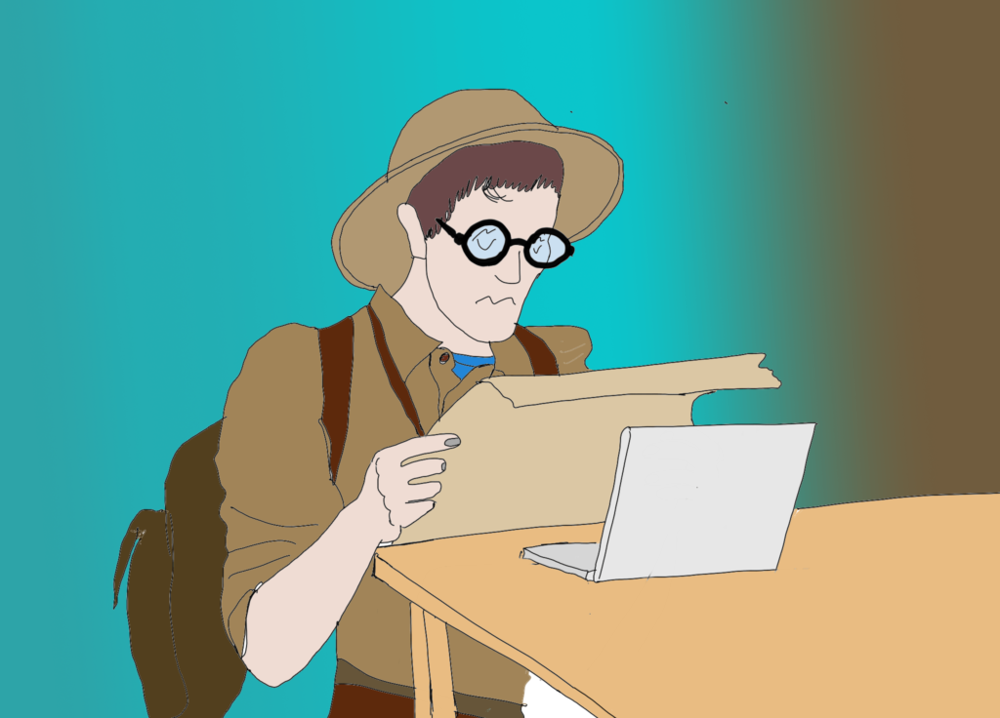

Pour vous aider à augmenter votre pouvoir d'achat malgré l'inflation, la première étape à réaliser est d'explorer vos dépenses. Elle permet de mieux **visualiser tous les frais qui rongent votre budget.** Cette étape permet de faire un bilan de l'année écoulée pour anticiper les frais à venir. C'est le premier pas vers la **maîtrise de vos dépenses**.

La ligne d'arrivée est proche avec comme **trophée à la clé : le contrôle de votre budget.**🏆

## Passer le cap de la lectures des extraits bancaires !

Dans cette étape, on va commencer par du lourd, du très lourd. Et surtout, c'est la phase la moins intéressante. En plus, il faut **décrypter les extraits bancaires**, et le mot est bien adapté. 😱

En prêtant plus attention à vos extraits, vous constaterez tout de suite que [nos banquiers ne nous facilitent pas la tâche.](https://www.moneyvox.fr/banque/actualites/72050/banque-pourquoi-les-releves-de-compte-sont-souvent-illisibles) Ils ne nous donnent guère envie de bouquiner. Ils ne sont pas plaisants à lire. Pourtant, on ne demande pas une BD. 🥵 Ils nous délivrent que des chiffres et des lignes qui de plus, sont souvent désorganisées et pas classées !

Et pourtant, ils ont un réel potentiel et **un contenu riche**. En autres, il nous indique ligne par ligne nos différentes dépenses ainsi que leur date de débit. Cependant, on a du mal à voir quel **type de paiement** on a utilisé, ou encore à quoi **correspond telle ou telle dépense**.

Est-ce intentionnel ? Je n'ai pas la raison, mais je me dis que c'est sûrement un enjeu pour eux. Par exemple : impossible de visualiser du premier coup le montant total de tous nos paiements effectués avec la CB ! Veulent-ils nous inciter à dépenser plus ?🤔

Pour moi, ce moyen de paiement est certainement le plus dangereux. Il est si facile et rapide de payer **avec sa CB, qu’on se laisse facilement prendre au jeu. On dépense sans vraiment compter**. Petit à petit, nous grignotons notre budget. C’est loin d’être notre amie, bien au contraire, c’est un vrai poison que nos banquiers ont mis entre nos mains.

Heureusement, il existe un antidote ! Commençons ensemble à soigner vos finances. 💉

## Explorer vos dépenses ! Cette première étape consiste à dresser la liste de tous vos frais.

<figure>

<figcaption>

Explorer vos dépenses

</figcaption>

</figure>

Êtes-vous prêt pour l'expédition ? 😎

Pour cela, je vous conseille de **prendre un stylo, une feuille vierge et bien sûr vos extraits bancaires** sur la dernière année. Eh oui, ce n'est pas un ou deux extraits, mais bien 12 à déchiffrer. 😱

Mais ne paniquez pas, une fois que vous vous serez plongés dans le déchiffrage du premier, tous les autres se ressemblent, les mêmes lignes, les mêmes infos. Alors courage, vous allez devenir le roi de la finance ! 👑

Commencer à **dresser une liste de vos dépenses** en vous inspirant des éléments ci-dessous :

- courses ;

- transport ;

- logement: loyer, crédit immobilier ;

- assurances ;

- crédits ;

- abonnements ;

- frais scolaires, cantine, achats scolaires, etc. ;

- loisirs : restaurant, spectacle, etc. ;

- achats: livres, divers,... ;

- les aménagements intérieurs et extérieurs (cet élément est souvent négligé, mais il fait souvent partie des dépenses annuelles.) ;

- entretien annuel ou bi-annuel: entretien chaudière, ramonage de la cheminée, entretien du véhicule, contrôle technique.

- les frais exceptionnels : électroménager à remplacer, etc. ;

- vos virements pour votre épargne.

Cette liste est non exhaustive et reste unique suivant les ménages. N'hésitez pas à m'envoyer un message pour que je puisse tenir compte de vos remarques. Cela pourrait aider de futur(e)s lecteur(rice)s. Cliquez [ici](https://commentgerersonbudget.fr/contact/ "contactez-moi") pour me contacter par messagerie, sinon utilisez le tchat.

Une fois la liste établie, il est temps de faire le tri. **Allez à la page suivante pour catégoriser** maintenant vos dépenses.
